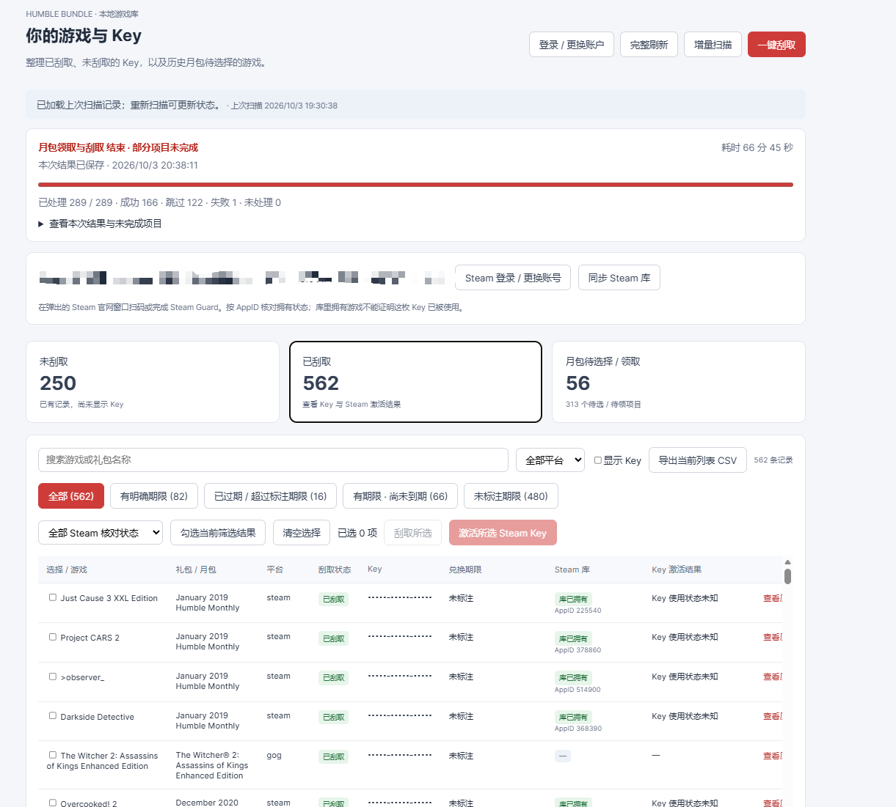

# Humble Key Manager

攒了好多年的 Humble Bundle，买的时候很积极，兑换的时候一直犯懒。
等想起来，已经分不清哪些没领、哪些自己有了、哪些甚至过期了。
所以做了这个本地可视化工具，把账户里的游戏和 Key 放在一起整理。

目前只支持 Humble Bundle，也没打算接别家——毕竟我自己没买过别家的慈善包。

## 自动刮取，不错过每一个 Key

扫描账户，把已刮取、未刮取和月包待领取的游戏分开看，再按需要批量刮取。
刮到哪了、成功多少、哪些缺货，界面里都能看到，已拿到的 Key 会及时保存。

## 把漏领的历史月包翻出来

几年前的 Choice 还没选？不用一个月一个月找。
新版无限额月份可以一键领取；旧版有额度的月份自己勾选游戏，预览剩余额度后再领。

## 看看懒癌已经损失多少 Key，还能抢救多少

有明确兑换期限的 Key 可以单独筛出来，看看哪些已经过期，哪些将要到期。
按过期时间排序，先救最着急的；也能只看「未过期 + 未标注期限」。

## 先对一下 Steam 库，别重复兑换

登录 Steam、同步库，就能看看哪些游戏自己已经有了。
**库里有这个游戏，不代表手里这枚 Key 已经被激活。** 没匹配到 AppID 的项目会显示「无法核对」。

## 本地记录里的 Steam Key 批量激活

筛选、勾选要激活的 Key，预览目标 Steam 账号和清单，确认后批量提交。
这个我自己还没试过，不过 Codex 给的单元测试是过了。

## 这个包的 Key，中国能不能激活？

读取 Humble 订单里的地区限制，单独显示中国可激活、不可激活、未标注锁区和未知。
可以筛掉明确不支持中国的项目，悬停查看原始地区列表，导出的 CSV 也会带上这些信息。
判断针对这份订单的 Key，不靠 Steam 商店能不能购买来猜；没有地区信息就保持未知。

## 导出 CSV，方便出 Key 给别人挑

把当前筛选出的列表导出成 CSV，不用再手抄游戏名。
隐藏 Key 时，CSV 也不带 Key 内容；勾选「显示 Key」后才会一起导出。

## 给自己的 Key 留点备注

给单条或多条记录打标签：已卖出、已赠送、已激活，或者自己随便起个名字。
刮了但自己已经有的、留给朋友的，也可以单独标记，之后按标签筛选或排除。
出售、赠送和已激活的记录会跳过批量激活；手动标为「已激活」会显示「已拥有（手动标记）」。
标签按 HB 账户保存在本地，重扫、重启后还在。

## 缺货了，先放一边，补货后再试

「Key 暂时缺货」有单独分类，不会和普通未刮取的记录混在一起找。
批量刮取遇到缺货会跳过，继续处理其他游戏，之后可以再回来重试。

## 今天整理不完，下次接着来

扫描记录、已刮取的 Key 和操作结果都保存在本地，下次打开直接读取。
中途停止也会保留已成功的结果；重新扫描可更新官网状态，不用重新登录和整理全部记录。
登录会话过期时再登录即可。

## 双击运行

去 [Release](https://github.com/haobo724/humble-key-manager/releases/latest) 下载 Windows 运行包：

| 版本 | 大小 | 适合谁 |
| --- | --- | --- |
| Edge 轻量版（`-edge.zip`） | 约 48 MB | 电脑已安装 Microsoft Edge，推荐这个 |
| 完整版（`windows-x64.zip`） | 约 360 MB | 需要附带 Chromium 浏览器 |

完整解压，保留 `_internal` 文件夹，双击 `HumbleKeyManager.exe`。
浏览器会自动打开界面，不需要安装 Python 或 uv。运行期间保留控制台窗口，关闭它即可退出。

v0.2 运行包包含 CSV 显示开关、自定义标签、暂时缺货分类和中国地区激活限制。
升级时换程序文件即可，本地数据目录保持不变。

## 详细说明

操作步骤、数据保存位置和开发说明放在 [Wiki](https://github.com/haobo724/humble-key-manager/wiki)：

- [使用指南：扫描、月包、筛选和 Steam 激活](https://github.com/haobo724/humble-key-manager/wiki/Usage)
- [数据与隐私：保存、备份和迁移](https://github.com/haobo724/humble-key-manager/wiki/Data-and-Privacy)
- [从源码运行与打包](https://github.com/haobo724/humble-key-manager/wiki/Development)

## 来源

基于 [gfargo/humble-bundle-keys](https://github.com/gfargo/humble-bundle-keys) 二次开发，
原作者 **Griffen Fargo**，保留 [MIT 许可证](LICENSE)。
上游基准提交：`4a6d1c4c3c74c63a22129213653f392f948b39e4`。
本项目独立发布，与 Humble Bundle、Valve / Steam、Epic Games 无官方合作关系。
地区字段的识别参考 [umaim/Humble-Key-Restriction](https://github.com/umaim/Humble-Key-Restriction)，
原作者 Cloud，MIT 许可；地区数据直接来自 Humble 订单，不上传 Key 给第三方。
