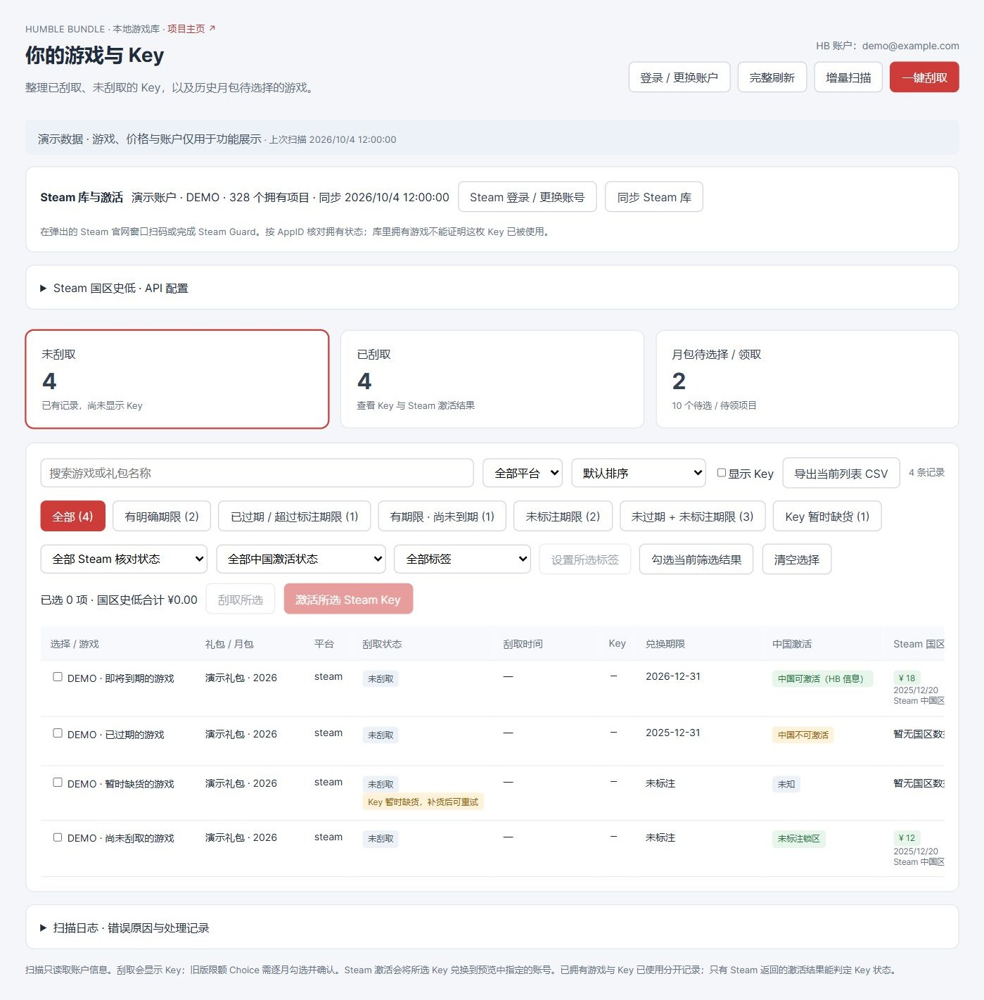
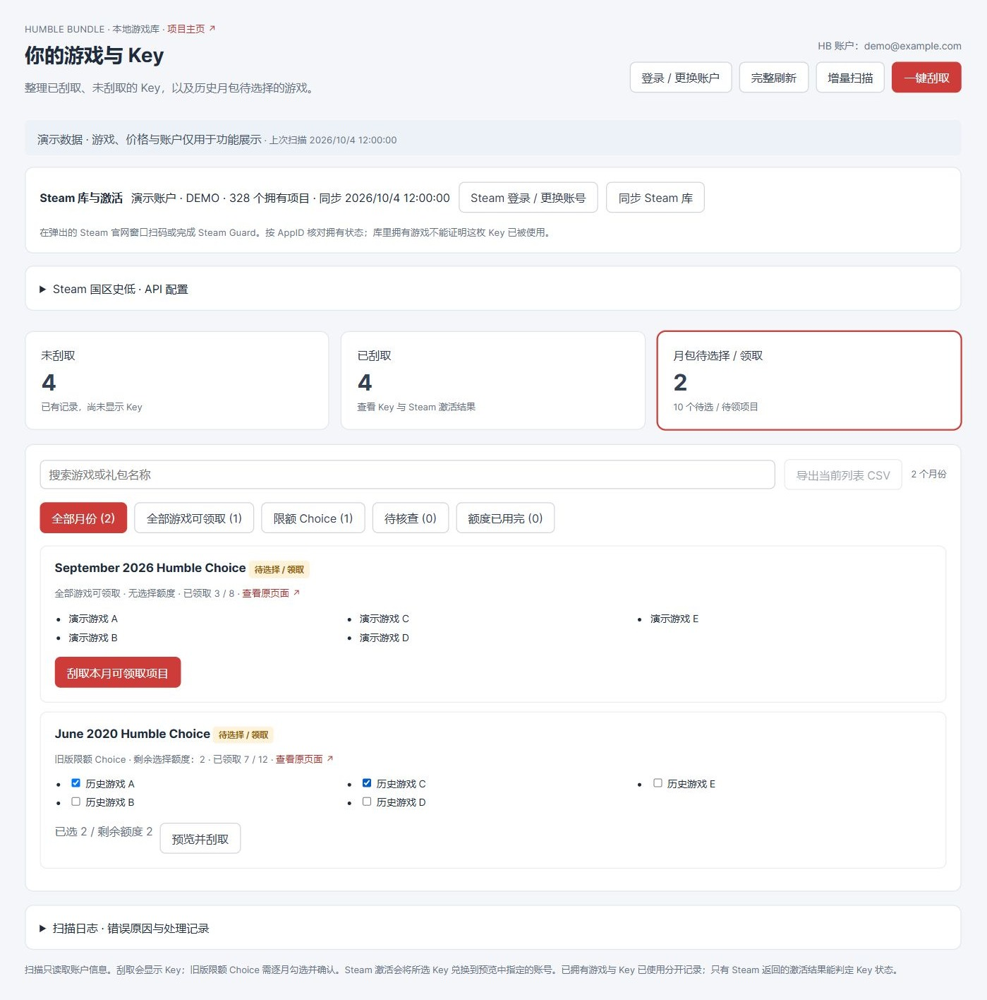
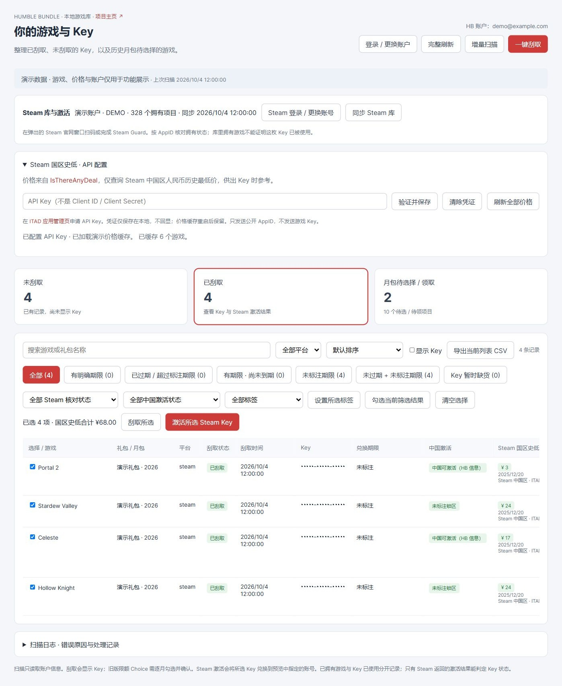
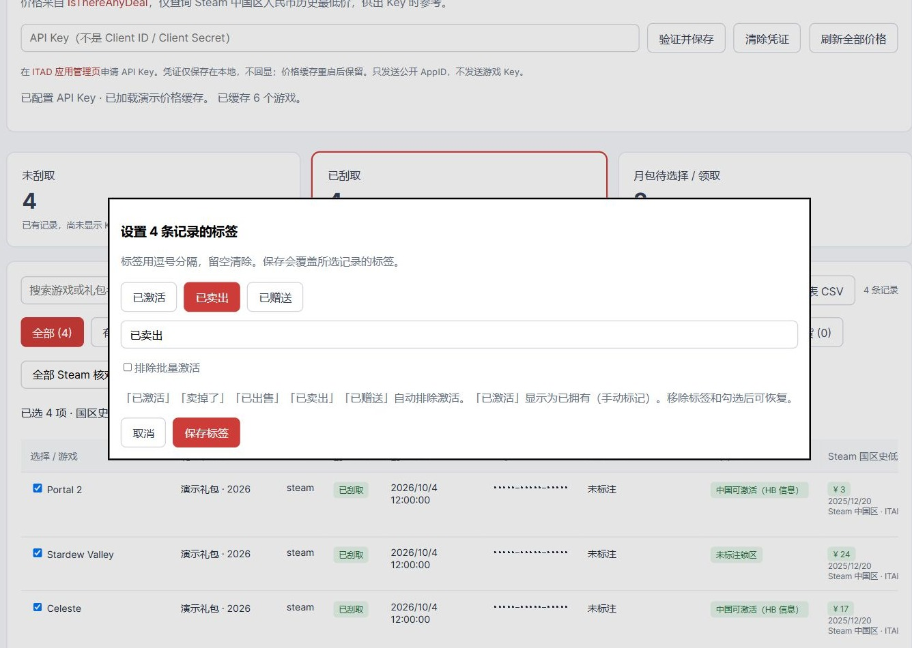

# Humble Key Manager

攒了好多年的 Humble Bundle，买的时候很积极，兑换的时候一直犯懒。
等想起来，已经分不清哪些没领、哪些自己有了、哪些甚至过期了。
所以做了这个本地可视化工具，想把积压的 Key 一次整理明白。

目前只支持 Humble Bundle，也没打算接别家——毕竟我自己没买过别家的慈善包。

[下载 Windows 运行包](https://github.com/haobo724/humble-key-manager/releases/latest) · [使用指南](https://github.com/haobo724/humble-key-manager/wiki/Usage) · [从源码运行](https://github.com/haobo724/humble-key-manager/wiki/Development)

*截图使用演示账户和数据；游戏、价格及领取情况仅用于展示，不含真实 Key 或 API 凭证。*

## 自动刮取，不错过每一个 Key

- 扫描整个账户，分开看已刮取、未刮取和月包待领取的游戏，按需要批量刮取。
- 看进度和结果总结，中途停止也会保留已取得的 Key。
- 筛出已过期、快到期和未标注期限的项目，按期限排序，先救最着急的。
- 暂时缺货的 Key 单独放一类，批量操作会跳过，补货后再试。

## 把漏领的历史月包翻出来

新版无限额月份可以直接领取；旧版有限额的 Choice，自己勾选游戏，核对剩余额度后再领。
不用为了找几款漏领的游戏，一个月一个月翻官网。

## 先看自己有没有，再决定激活哪些

- 登录 Steam、同步游戏库，按 AppID 对照哪些已经有了；匹配不到的显示「无法核对」。
- 读取 Humble 订单的地区限制，筛选中国可激活、不可激活、未标注锁区和未知。
- 勾选 Steam Key，预览目标账号和清单，确认后批量激活。

**库里有这个游戏，不代表手里这枚 Key 已经被激活。** 地区判断也只依据这份订单的信息，没有信息就保持未知。
批量激活我自己还没试过，不过 Codex 给的单元测试是过了。

## 想出 Key，先整理一份清单

- 配置自己的 ITAD API Key，查询 **Steam 国区人民币史低**，连同日期保存在本地。
- 勾选几款游戏，直接看史低合计；没有价格的项目注明数量，不计入总价。
- 将当前筛选结果导出 CSV，方便给别人挑。隐藏 Key 时，CSV 也不带 Key 内容。

史低是参考价格，不是二手 Key 成交价。没有国区记录的游戏不会拿其他地区价格补上。

## 卖了、送了、留给朋友的，自己记一笔

单条或多条记录都能打标签：已卖出、已赠送、已激活，或者自己起个名字。
之后按标签筛选；出售、赠送和已激活的记录会排除批量激活。
手动标为「已激活」会显示「已拥有（手动标记）」，标签按 HB 账户保存，重扫后还在。

ss

## 双击运行，下次接着整理

去 [Release](https://github.com/haobo724/humble-key-manager/releases/latest) 下载 Windows 运行包：

| 版本 | 大小 | 适合谁 |
| --- | --- | --- |
| Edge 轻量版（`-edge.zip`） | 约 48 MB | 已安装 Microsoft Edge，推荐这个 |
| 完整版（`windows-x64.zip`） | 约 360 MB | 需要附带 Chromium 浏览器 |

完整解压，保留 `_internal` 文件夹，双击 `HumbleKeyManager.exe`，浏览器就会打开界面。
无需安装 Python 或 uv；运行期间保留控制台窗口，关闭它即可退出。

扫描记录、已刮取的 Key、标签和操作结果都保存在本地，下次打开直接读取。
源码版默认保存在项目的 `.humble-bundle-keys/web`；Windows 运行包保存在 `%LOCALAPPDATA%\HumbleKeyManager\data`。
重新扫描更新官网状态，会话过期时再登录；升级运行包时保留原数据目录即可。
ITAD API 凭证也只保存在本地，不会上传 GitHub。

## 详细说明

具体步骤和开发说明放在 [Wiki](https://github.com/haobo724/humble-key-manager/wiki)：

- [扫描、月包、筛选和 Steam 激活](https://github.com/haobo724/humble-key-manager/wiki/Usage)
- [数据保存、备份和迁移](https://github.com/haobo724/humble-key-manager/wiki/Data-and-Privacy)
- [从源码运行与打包](https://github.com/haobo724/humble-key-manager/wiki/Development)

## 来源

基于 [gfargo/humble-bundle-keys](https://github.com/gfargo/humble-bundle-keys) 二次开发，
原作者 **Griffen Fargo**，保留 [MIT 许可证](LICENSE)。
上游基准提交：`4a6d1c4c3c74c63a22129213653f392f948b39e4`。
本项目独立发布，与 Humble Bundle、Valve / Steam、Epic Games 无官方合作关系。
地区字段的识别参考 [umaim/Humble-Key-Restriction](https://github.com/umaim/Humble-Key-Restriction)，
原作者 Cloud，MIT 许可；地区数据直接来自 Humble 订单，不上传 Key 给第三方。
