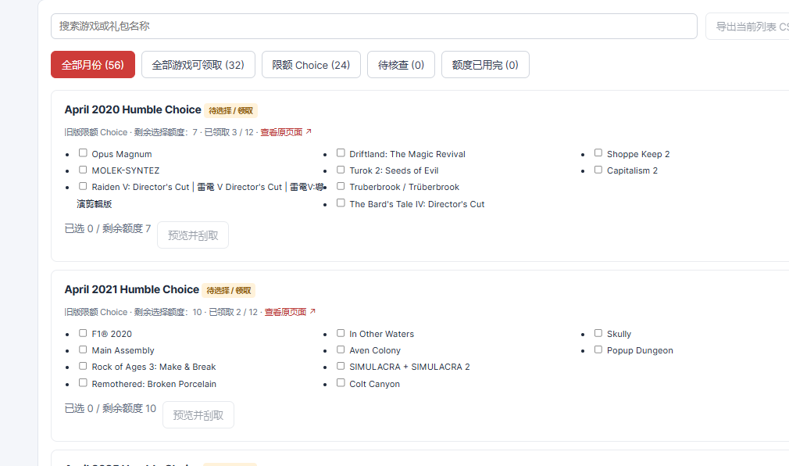
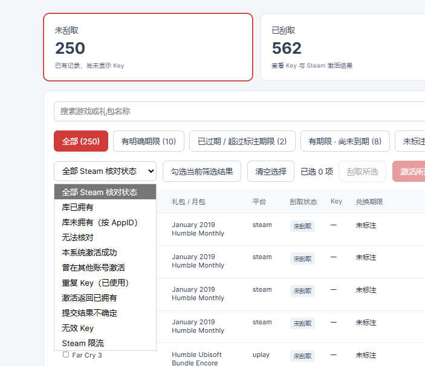

# Humble Key Manager

本地 Humble Bundle 游戏与 Key 管理器：历史 Choice 选择、批量刮取、期限筛选、Steam 库核对和显式批量激活。

做这个主要是想清理自己攒了好多年、一直懒得兑换的 Key。一个个翻月包实在太麻烦，
索性做个可视化界面，把没领的游戏、没刮的 Key 和 Steam 库放在一起管理。
目前只支持 Humble Bundle，暂时也没打算接别的平台——毕竟我自己没买过别家的慈善包。

## 界面预览

游戏列表、刮取进度和结果汇总：


旧版 Choice 按月勾选，先看剩余额度再领取：



按兑换期限和 Steam 库状态筛选：



## 来源与许可

基于 **[gfargo/humble-bundle-keys](https://github.com/gfargo/humble-bundle-keys)** 二次开发。
原作者 **Griffen Fargo**，采用 **MIT** 许可证，保留原项目 [LICENSE](LICENSE)。
上游基准提交：`4a6d1c4c3c74c63a22129213653f392f948b39e4`。
本仓库为独立发布版，新增本地 Web UI、Steam 集成、月包并行处理及持久化操作汇总。
与 Humble Bundle、Valve / Steam、Epic Games 无隶属或官方合作关系。

## 安装

需要 Python 3.10+ 和 uv。Windows 优先使用已安装的 Microsoft Edge；其他系统使用 Playwright Chromium。

```powershell
git clone https://github.com/haobo724/humble-key-manager.git
cd humble-key-manager
```

## 本地 Web 管理界面（新增）

在仓库目录运行：

```powershell
uv sync --extra dev
uv run playwright install chromium
uv run humble-bundle-keys-web
```

也可运行 `start-web.ps1`。默认打开 http://127.0.0.1:8765 。点击「登录 / 更换账户」
在 Humble 官网登录，然后点击「扫描账户」。扫描也会在缺少有效会话时自动打开登录窗口。
Windows 上优先使用已安装的 Microsoft Edge 打开登录和扫描窗口；没有 Edge 时使用
Playwright Chromium。窗口使用独立会话，不读取你平时 Edge 的浏览记录。

- 已刮取：存在 Key 文本；不代表已在 Steam 激活。
- 未刮取：订单已有记录，但没有 Key 文本。
- 月包待选择 / 领取：只读访问订阅月份页面，读取未领取卡片和订单里的剩余额度。
  旧版月包候选游戏可能尚未出现在订单 Key 列表中，因此单独展示。
  无法识别页面会标为「待核查」；额度为零的月份单独标记，不当作仍可选择。
- 支持搜索、平台筛选、默认隐藏 Key、导出当前 Key 列表 CSV。
- 期限子分类：有明确期限、已过期 / 超过标注期限、有期限但尚未到期、未标注期限。
  无法解析的期限保持原文，不推断有效性；没有时区的日期按 UTC 日期结束后判断。
- 增量扫描最多并发读取 3 个订单，最多并行检查 2 个 Choice 页面。已刮取完的订单
  缓存 6 小时、已领取完的 Choice 页面缓存 1 小时；未刮取和待选项目每次重新检查。
  「完整刷新」绕过缓存。订单先显示，每 20 个订单 / 5 个月份保存进度。
- 旧版 `_monthly` 订单直接提取 Key，不访问 Choice 选择页；扫描日志记录此处理。
- 可展开页面底部「扫描日志」查看 HTTP 状态、跳转、加载超时和选择器不匹配等原因。
  日志位于 `.humble-bundle-keys/web/scan.log`，轮转保存，不含 Key、Cookie 或订单链接。
- 自动轮询只更新变化的数据，列表滚动位置在扫描更新时保留。

「一键刮取」先展示范围，再领取普通礼包 / Monthly 的可用 Key 和 2022 年 2 月起的
无限额 Choice 游戏。已显示、已标记过期、无 Key 交付及不支持项目跳过。旧版限额及
规则未知 Choice 不自动选择。刮取逐个执行，成功结果立即保存，可点击「停止刮取」。
执行后自动更新列表，不会在 Steam 激活。新版 Choice 显示「全部游戏可领取」，
旧版显示剩余额度；未知规则不会推断为无限额。

刮取时显示当前阶段、正在处理的游戏、已处理 / 总数、成功 / 跳过 / 失败及耗时。
结束后保留成功提示和结果明细；停止、部分失败或服务中断时保留已成功结果与未处理项目。
汇总保存在 `operation-report.json`，刷新页面或重启服务后仍可查看，不包含 Key 文本。
要求关联 Epic 账号直接领取的项目会记为跳过并继续，不自动关联账号或兑换。
Humble 明确提示 Key 暂时缺货时也记为跳过并继续，保留未取得 Key 的记录以便补货后处理。

月包列表增加「全部游戏可领取」「限额 Choice」「待核查」「额度已用完」子分类。
无限额月份可「刮取本月全部」，也可在该子分类「刮取此分类（当前筛选）」，
预览范围只包括当前筛选出的无限额月份。限额月份逐月勾选游戏，点击「预览并刮取」。
预览直接依据当前扫描记录展示所选游戏、预计消耗与剩余额度，不连接 Humble 重扫月份。
确认后逐月核对并立即刮取，不先遍历整份清单；只领取清单里的游戏。
限额月份仍检查实际额度；未知额度、超过额度、规则变化或游戏已被领取会拒绝。
批量处理无限额月份时最多 2 个月份并行，各用独立浏览器会话；同月内逐个执行。
限额月份在并行任务完成后串行执行。异常或结果不确定时停止启动后续月份；已保存结果保留。
每次领取后保存 Key 并更新实际额度；领取失败或结果不确定就停止，不自动重试。
这不会在 Steam 激活；需要激活时在已刮取列表另行勾选。

### Steam 库核对与批量操作

点击「Steam 登录 / 更换账号」，在 Steam 官网窗口扫码或完成 Steam Guard。
独立会话保存在 `steam-storage-state.json`，不会读取日常浏览器的 Cookie，也不保存密码。
登录后自动同步库；「同步 Steam 库」可更新记录。按 Humble 的 `steam_app_id` 精确核对；
没有 AppID 的项目显示「无法核对」，不根据相似名称推断拥有状态。

列表可勾选游戏或「勾选当前筛选结果」，再「刮取所选」或「激活所选 Steam Key」。
激活预览显示目标 Steam 账号和清单，阅读并确认 Steam 订户协议后才能开始。
只提交 Steam Key；跳过已拥有、已过期、已成功激活、重复、无效和结果不确定的记录。
逐个激活，每次间隔 5 秒；限流或网络结果不确定会停止，可随时「停止当前操作」。
每项结果立即保存，刷新、重扫、重启仍保留；更换 Steam 账号后分别记录。

「库已拥有」并不等于某枚 Key 用过。「本系统激活成功」来自本次成功返回；
「重复 Key」来自 Steam 的重复返回；「已拥有」返回仍保持 Key 使用状态未知。
未拥有也不能证明 Key 未使用。Steam 没有独立的只读 Key 有效性检查，本系统不提供
伪装成只读验证的试激活：提交未使用的有效 Key 会实际激活到确认的账号。
Steam 结果保存在 `steam.json`，仅以 Key 的 SHA-256 标识记录；日志不记录原始 Key 或会话。
本系统确认激活成功的 Key 会显示「✓ 本系统已激活」，按 HB 账号保存在
`hb-activations.json`。重新扫描、重启或切换 Steam 账号后标记仍在；切换 HB 账号各自读取。
记录用账号和 Key 的摘要索引，不保存明文 HB 邮箱或 Key；库已拥有、重复 Key 不算成功标记。

扫描仍然只读。月包页面选择器需要登录后的真实
账户验证；未标注兑换期限的 Key 显示「未标注」。登录会话和扫描记录保存在当前目录下
`.humble-bundle-keys/web/`，已被 Git 忽略。更换账户后请重新扫描；扫描结束前仍显示旧记录。
服务仅监听本机回环地址。按 Ctrl+C 关闭；`--port` 可更换端口，`--no-open` 不自动打开浏览器。


## 数据与隐私

数据保存在运行目录下的 `.humble-bundle-keys/web/`，用本地 JSON 文件记录游戏列表、
Key、登录会话、Steam 库和最近一次刮取结果。下次启动会自动读取，不用从头扫；
重新扫描才更新官网状态，登录会话过期后再登录即可。

换目录运行时，可以用 `--data-dir "你的旧数据目录"` 继续读取原记录。
备份整个数据目录就能保留记录，但里面有真实 Key 和登录会话，不要上传或分享。
这个目录已被 Git 忽略，仓库里没有真实账户数据。
上游捕获样例中的订单标识和 Key 已替换为一致的合成数据；使用全新的 Git 历史独立发布。
保留原命令行 `humble-bundle-keys`，Web 入口为 `humble-bundle-keys-web`。
并行仅用于批量无限额 Choice 月份，最多 2 个独立浏览器会话；同月内和限额月份串行。
Steam 激活与普通订单 Key 刮取仍逐个执行。
